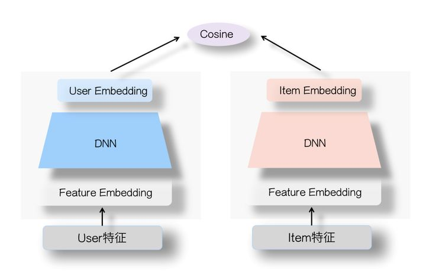

## 基本思想

双塔模型与协同过滤，是工业界占比最大的两个召回通道。对于双塔模型来说，其做法是将向量化后的用户特征和物料特征，分别进入DNN网络后，然后计算用户特征和物料特征之间的相似性。

由于双塔模型可以应用所有特征，以及在线上可以提前部署已算好的物料embedding，提升计算效率，所以双塔模型应用广泛，且适合召回和粗排部分。

但是由于两塔分离，彼此特征不交叉，只在最后求相似度，限制了双塔模型的精度上限。

另外，双塔可以做多目标。只需要将用户塔的输出改为输出多个用户embedding，分别计算这几个embedding和物料特征塔的输出embedding的相似度即可。

## 参考

1. [cikm2013_DSSM_fullversion](paper/cikm2013_DSSM_fullversion.pdf)
