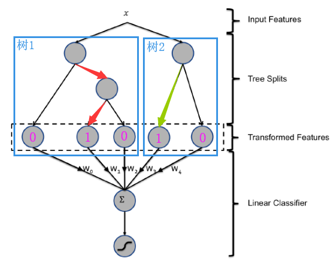
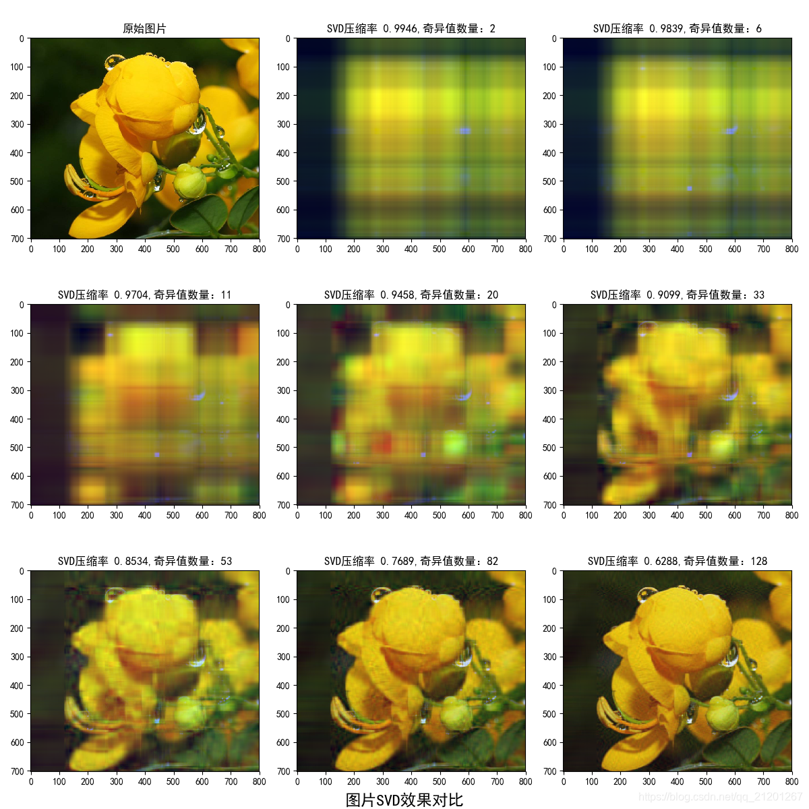

## 基本思想

GBDT (Gradient Boost Decision Tree)基于集成学习中的boosting思想，每次迭代都通过生成一颗回归树来拟合残差。以此减少误差。逻辑回归 (Logistic Regression)性能很高，但其效果依赖于特征工程。因此Facebook在2004年提出，通过GBDT自动发现并构造特征，LR对特征加权来提升广告点击率 (CTR)效果。
在GBDT+LR模型中，输入的样本特征最终会通过每一棵回归树落在某一个叶子节点，将该叶子节点记作1，其他叶子节点记作0，将所有树的编码拼接起来，得到了一组新的转换特征（其中1的数量为回归树的数量）。将这组新的转换特征输入LR模型，完成CTR预估。

***
# GBDT
GBDT 的全称是 Gradient Boosting Decision Tree，梯度提升树。
## 决策树 (Decision Tree) ：CART回归树
无论是回归还是分类问题，GBDT使用的决策树是CART回归树。使用回归树，主要是因为每次迭代所拟合的是梯度值（一个连续值）。
对于回归树算法来说最重要的是寻找最佳的划分点，那么回归树中的可划分点包含了所有特征的所有可取的值。在分类树中最佳划分点的判别标准是熵或者基尼系数，都是用纯度来衡量的，但是在回归树中的样本标签是连续数值，所以再使用熵之类的指标不再合适，取而代之的是平方误差，它能很好的评判拟合程度。

### 回归树生成算法
在训练数据集所在的输入空间中，递归的将每个区域划分为两个子区域并决定每个子区域上的输出值，构建二叉决策树。
节点的切分方式：对数据集的每一个特征的每一个数据对应的分量值做切分，计算各个情况下所分的两组数据的标签值与同组的标签值的均值的平方误差，取左右子树的平方误差和最小的切分方式作为该节点的分类方式。
## 梯度提升 (Gradient Boosting)
梯度提升是Boosting（提升）的一种改进，只是在迭代过程中，将损失函数设置为平方损失函数，平方损失的负梯度作为提升树算法中每棵树的残差的近似值。故而在回归问题中，目标为拟合残差。
## 个人感想
理论上，GBDT部分很像矩阵做SVD保存信息。
在SVD中的特征矩阵中，越靠近左上角保留的信息越多，靠近右下的特征值即便丢弃一些，复原的矩阵仍然保留有原矩阵的大部分信息（也是图片压缩的原理）

而GBDT靠前的树会拟合的更接近真实值，也就是说，从第一棵树到最后一棵树，拟合的残差越来越小，和SVD的奇异值占据信息的比例越来越小有异曲同工之妙。对于更靠前的树所落下来信息的子节点，理应也在LR训练时，权重也更大。（做个训练，打印权重试一下）

# 参考
1. [GBDT算法原理以及实例理解_gbdt算法实例 csdn-CSDN博客](https://blog.csdn.net/zpalyq110/article/details/79527653)
2. [基于奇异值分解（SVD）的图片压缩实践_为什么经过奇异值分解后的图片是黑色的-CSDN博客](https://blog.csdn.net/qq_21201267/article/details/105694867)
3. 